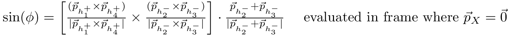

# fourbody
[](https://github.com/richard-lane/fourbody/actions)
[](https://codecov.io/gh/richard-lane/fourbody)

Four body phase space parameterisation using invariant masses and helicity angles: (M+, M-, cos(θ+), cos(θ-), ϕ).

For the decay `X -> h1+ h2- h3- h4+`, we define our phase space variables as follows:
  
  
  
  
  


Also included is the formula to calulate `sin(phi)` directly: this is used in the automated tests to check we have evaluated `phi` correctly.


This parameterisation is from the original paper by Cabibbo and Maksymowicz[^1],
evaluated using the formulae in [^2].


[^1]: Cabibbo, N., & Maksymowicz, A. (1965). Angular Correlations in K_e4 Decays and
 Determination of Low-Energy pi-pi Phase Shifts. Phys. Rev., 137, B438–B443. doi:10.
 1103/PhysRev.137.B438

[^2]: Harnew, S., Naik, P., Prouve, C., Rademacker, J., & Asner, D. (2018).
 Model-independent determination of the strong phase difference between D^0 and Dbar0
 to pi+ pi- pi+ pi-$ amplitudes. JHEP, 01, 144. doi:10.1007/JHEP01(2018)144

## Requirements
Basic functionality requires:
 ```
 numpy
 pylorentz
 ```

Additionally, if you wish to run the [unit tests](test/ut/), [integration](test/it) and [system tests](test/script):
 ```
 pytest
 phasespace
 matplotlib
 ```

## Installation
`pip install fourbody`  
This doesn't work yet but hopefully it will soon.  
Otherwise just clone this repo

## API
All the functionality is provided by a single function, [`fourbody.param.helicity_param`](fourbody/param.py#24).

## Example
```python
""" Example for the decay D->K+K-pi+pi- """
import uproot
import matplotlib.pyplot as plt

from fourbody.param import helicity_param

# Read particle data from somewhere (e.g. a ROOT file)
with uproot.open("my_root_file.root") as f:
    tree = f["my_tree_name"]

# The parameterisation function takes shape (4, N) arrays of particle (px, py, pz, energy)
k_plus = np.array(
    [
        tree[branch].array()
        for branch in ("k_plus_px", "k_plus_py", "k_plus_pz", "k_plus_e")
    ]
)
k_minus = np.array(
    [
        tree[branch].array()
        for branch in ("k_minus_px", "k_minus_py", "k_minus_pz", "k_minus_e")
    ]
)
pi_plus = np.array(
    [
        tree[branch].array()
        for branch in ("pi_plus_px", "pi_plus_py", "pi_plus_pz", "pi_plus_e")
    ]
)
pi_minus = np.array(
    [
        tree[branch].array()
        for branch in ("pi_minus_px", "pi_minus_py", "pi_minus_pz", "pi_minus_e")
    ]
)

# Parameterise
# Since this function is meant for decays X->h1+ h2- h3- h4+, pass the particles in in  
# the order K+ K- pi- pi+
points = helicity_param(k_plus)

print(points.shape)  # prints (N, 5); we have an array of N 5d points

# Plot projections of our 5d points as histograms
kw = {"bins": 100, "histtype": "step"}
fig, ax = plt.subplots(1, 5, figsize=(25, 5))
labels = "M+", "M-", r"cos($\theta_+$)", r"cos($\theta_-$)", r"$\phi$"

for i, a in enumerate(ax):
    a.hist(points[:, i], **kw)
    a.set_xlabel(labels[i])

plt.savefig("example.png")

```

## [Dashboard](doc/dashboard/README.md)
A dashboard of live status updates is [here](doc/dashboard/README.md).  
This will be updated live using the plots generated by the GitHub Actions CI whenever it runs successfully.
